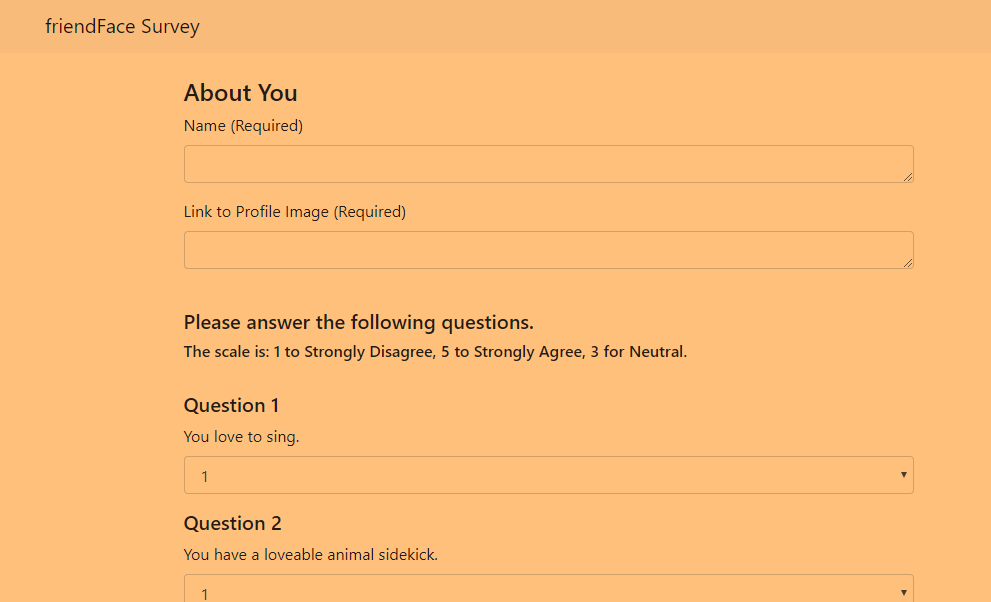

# friendface
Yes, I totally named this project after the site on IT Crowd that satirizes the social network we all know.

### live heroku link:
https://hidden-river-56114.herokuapp.com/

## Overview

This project riffs on the ubiquitous dating app. The user enters their name and profile image and answers a series of questions, and is then presented with the closest match.

## Flow

### 1. Landing Page

The [very basic] landing page presents the user with the main option of beginning a survey. 
There are links at the bottome to the API data dump, the github repo, and a wee surprise (which is essentially the API data dump except it pulls images from the database which I have linked to but not actually used logic from. See future improvements, ha!)

### 2. The Survey

On the survey page, the user enters their information and clicks the submit button. On the button click, the user's data input is sent to the backend via a jquery ajax call, and is also stored into the friendface database. 

### 3. The Results

Once the user's data reaches the backend, the user's scores are compared to all the scores saved in the API. The user is then shown a [very scary] modal that displays their match and their match's profile picture! 

## Technologies
* jQuery
* JSON
* Node.js
    * mysql (a wee bit sure)
    * path
    * Express
* Bootstrap 

## Future Improvements
* Currently, if two potential friends share the same difference score, the app will just return the first of these. Perhaps a way you could compare two users in that case would be to see if one had more of the same answers than the others (i.e., the difference between three answers of 0,0,4 and 1,1,2 would return the same overall difference of 4, but you could argue that the first might be a better match since they were exactly aligned on two answers. But we're running the risk of getting subjective here).
* I managed to get the database linked - the user's entries are saved in the database and can be displayed via the wee easter egg on the homepage. But, it would be extra nice to actually use a database query for the logic, and not only run the logic from the API. 
* The modal. Oh lawd, the modal. It is extremely basic right now - displays the text and image it's supposed to but MY does it look ghastly.
* Currently users can get away with not entering their name or profile picture. It would be good to make that impossible.
* Would be nice to have some semblance of design...I tried to use a background image, and that image shows up locally, but I guess Heroku doesn't like it. 
